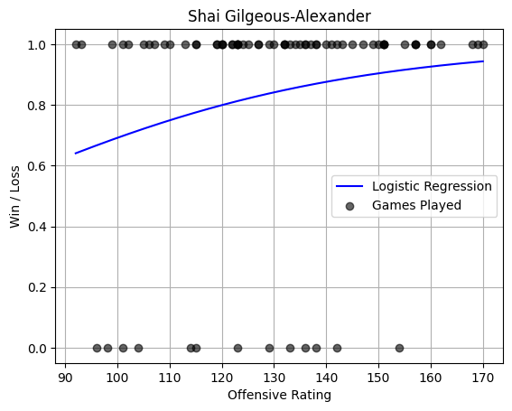
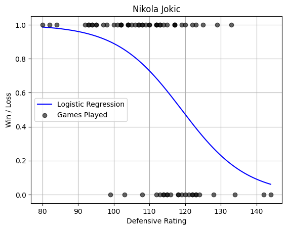
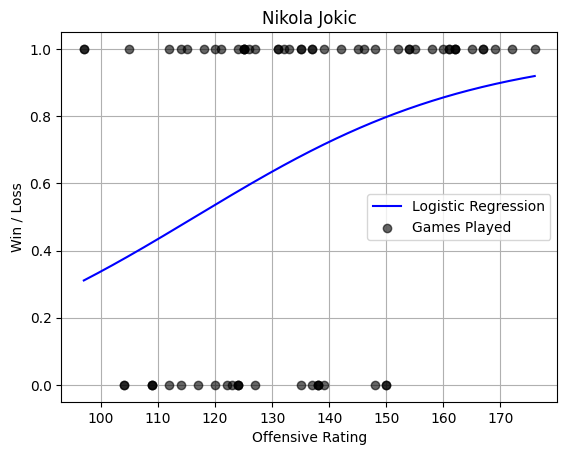
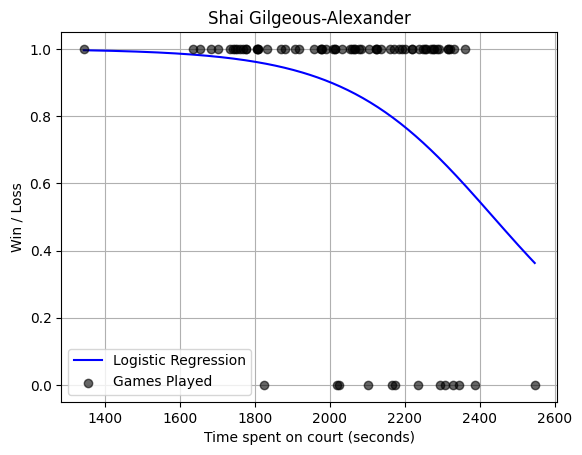
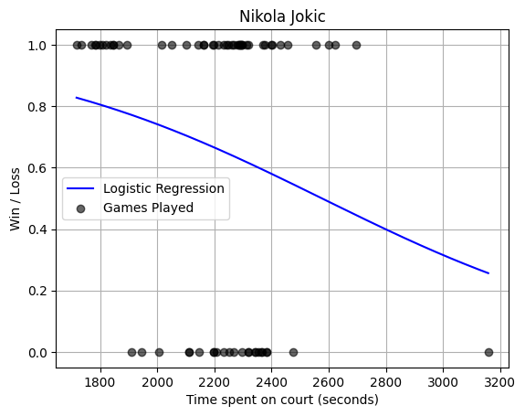

## The Flawed Stats of MVP Arguments

Let’s begin by defining what MVP means as the definition tends to be subjective in each conversation. In this article, the MVP will be defined as the Most Valuable Player in the league, meaning that the individual player is able to influence winning the most in the league.

A common tool that is used in debates to determine MVPs tend to be stats. We tend to look at stats in the upper percentile to even qualify for the MVP. For example, in the 2024-2025 NBA season, a common stat that would be brought up would be SGA led the league in scoring with 32.7PPG which ultimately contributed to the decision of him selected for 2024-2025 MVP.

Diving further into the 2024-2025 season, the MVP debate commonly landed between Jokic and Shai with the comparison of stats to back up the decision to choose one over the other. 

However, this system of comparison is ultimately flawed when it comes to dictating value on the floor, as each metric inherently holds a different weighting of importance when it comes to its contribution to winning. For example, one point does not necessarily equate to a steal and by having a large amount of steals, does that contribute to winning as much as having a large amount of points.

The easiest way to determine what stat to focus on is by identifying the correlation between the stat and winning for a particular player.

Why not find the correlation for stats across the whole league you might ask. 

The answer is because the value each stat is different across players and their positions. For example a pass from Jokic (a play maker) is different to a pass from Michael Porter Junior (a shooter who passes because they got blitzed/doubled). Thus by aggregating the entire league, we lose the intracacies of each player.

 

Using the below formula for point biserial correlation:

$$
r_{pb} = \frac{M_1 - M_0}{s_n} \cdot \sqrt{\frac{n_1 n_0}{n^2}}
$$

**Where:**

- $r_{pb}$ = the correlation coefficient  
- $M_1$ = the mean of the particular stat when there is a win  
- $M_0$ = the mean of the particular stat when there is a loss  
- $s_n$ = standard deviation of the stat regardless of win / loss  
- $n_1$ = number of datapoints given a win  
- $n_0$ = number of datapoints given a loss  
- $n_2$ = total number of datapoints 

The output $r_{pb}$ will be a range from $[-1, 1]$ where $-1$ means it is negatively correlated, a result of $1$ means it is positively correlated and $0$ means there is no correlation at all.
 

The correlation between commonly used stats and winning of the 2 MVP candidates of the 2024-2025 season:

| Stat  | Shai Gilgeous-Alexander | Nikola Jokic |
|-------|-------------------------|--------------|
| MP    | -0.3256                  | -0.2111      |
| TS%   | 0.1182                   | 0.1988       |
| eFG%  | 0.0994                   | 0.1364       |
| ORB%  | 0.0741                   | 0.0933       |
| DRB%  | 0.1233                   | 0.1262       |
| TRB%  | 0.1815                   | 0.2119       |
| AST%  | 0.0008                   | 0.0497       |
| STL%  | 0.1780                   | 0.1900       |
| BLK%  | 0.1694                   | 0.1188       |
| TOV%  | -0.2036                  | -0.0105      |
| USG%  | 0.2055                   | -0.1410      |
| ORtg  | 0.1998                   | 0.3379       |
| DRtg  | -0.5826                  | -0.4801      |
| GmSc  | 0.1974                   | 0.1144       |
| BPM   | 0.2816                   | 0.1714       |
| FG    | 0.1032                   | -0.1566      |
| FGA   | 0.0608                   | -0.2347      |
| FG%   | 0.0872                   | 0.1745       |
| 3P    | 0.1350                   | -0.1521      |
| 3PA   | 0.1870                   | -0.2830      |
| 3P%   | 0.0299                   | 0.1407       |
| 2P    | 0.0518                   | -0.1082      |
| 2PA   | -0.0434                  | -0.1304      |
| 2P%   | 0.1190                   | 0.0920       |
| eFG%  | 0.0994                   | 0.1364       |
| FT    | -0.0018                  | 0.1194       |
| FTA   | -0.0377                  | 0.0847       |
| FT%   | 0.1654                   | 0.0625       |
| ORB   | 0.0525                   | -0.0070      |
| DRB   | 0.1038                   | 0.1410       |
| TRB   | 0.1108                   | 0.1116       |
| AST   | -0.0597                  | 0.1788       |
| STL   | 0.1461                   | 0.1676       |
| BLK   | 0.1412                   | 0.1300       |
| TOV   | -0.2387                  | -0.0703      |
| PF    | -0.1023                  | -0.0254      |
| PTS   | 0.1068                   | -0.1063      |
| +/-   | 0.5885                   | 0.6843       |

 

Note:
- Nikola Jokic played 70 games
- Shai Gilegeous-Alexander played 76

 

With these stats present, we can see that the majority of raw stats and a handful of advanced stats don't correlate well with winning with the exception of the following:

| Stat  | Shai Gilgeous-Alexander | Nikola Jokic |
|-------|-------------------------|--------------|
| MP    | -0.3256                  | -0.2111      |
| TS%   | 0.1182                   | 0.1988       |
| DRB%  | 0.1233                   | 0.1262       |
| TRB%  | 0.1815                   | 0.2119       |
| STL%  | 0.1780                   | 0.1900       |
| BLK%  | 0.1694                   | 0.1188       |
| TOV%  | -0.2036                  | -0.0105      |
| USG%  | 0.2055                   | -0.1410      |
| ORtg  | 0.1998                   | 0.3379       |
| DRtg  | -0.5826                  | -0.4801      |
| GmSc  | 0.1974                   | 0.1144       |
| +/-   | 0.5885                   | 0.6843       |
| BPM   | 0.2816                   | 0.1714       |

Using just these correlation numbers we can see the difference in playstyles and the context of their teams respectively.

There is a lot to break down, so we will only touch on distinguishing features.

What immediately comes to my attention is the difference in correlation of USG% from the 2 players.

Nikola Jokic has a negatively correlating USG% whilst SGA is positively correlated. This ultimately comes down to the difference in playstyles with Nikola being predominately a playmaking big man whilst SGA is a score dominant point guard. Thus when we see the two at their most effective, one will be less ball dominant, setting up plays for their teammates whilst the other will demand more of the ball to make an impact.

Looking at the stat that correlates the most to winning, DRtg (Defensive Rating) and its close cousin, ORtg (Offensive Rating). For both players, reducing the amount of the opposing team's points is more impactful than scoring more points. Maybe Nico Harrison was onto something when he said "defence wins championships".

| Defensive Rating | Offensive Rating |
|---------|---------|
|  |  |
|  |  |

 

Another notable stat is that the minutes played is negatively correlated to winning. At first the logical statement to make is that these players are so cheeks that when they spend time on the court, they are actively dragging the team down. However, from context we know that this is incorrect. During the regular season, teams tend to sit star players out early when winning by a large margin to reduce likelihood of injury. Therefore the correct statement to make here is that rather than contributing to winning by playing less, they tend to play less when winning.

|  |  |
|---------|---------|

 

**Concluding statement**

The next time we hear Stephen A Smith bring up stats to make a statement about a player, it's necessary to be able to distinguish does this stat actually matter? Does it impact winning as much as he makes it sound?